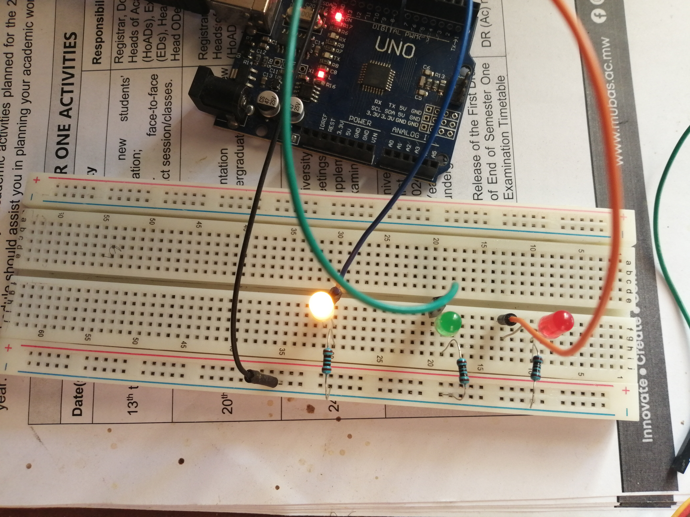
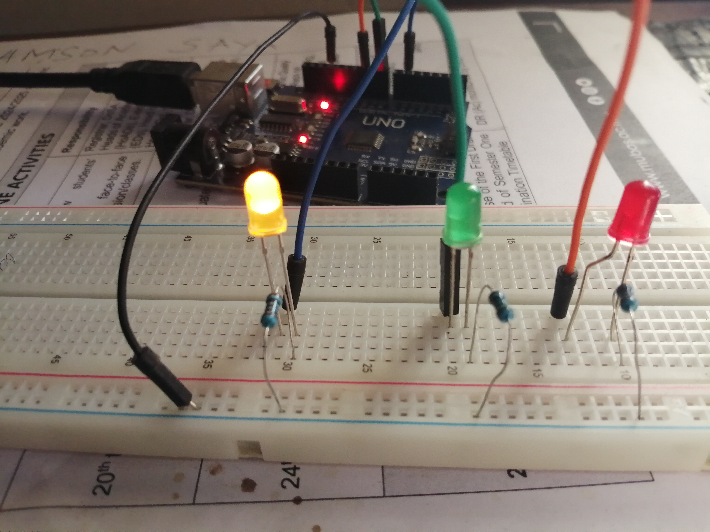
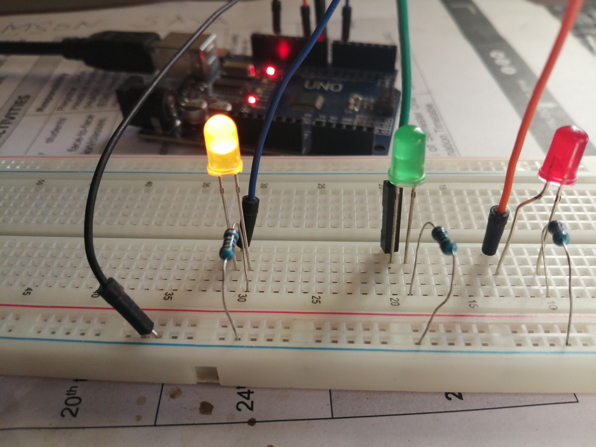
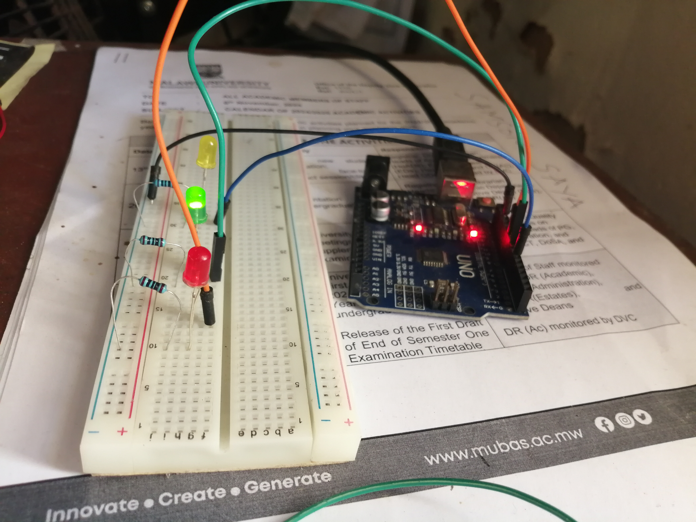
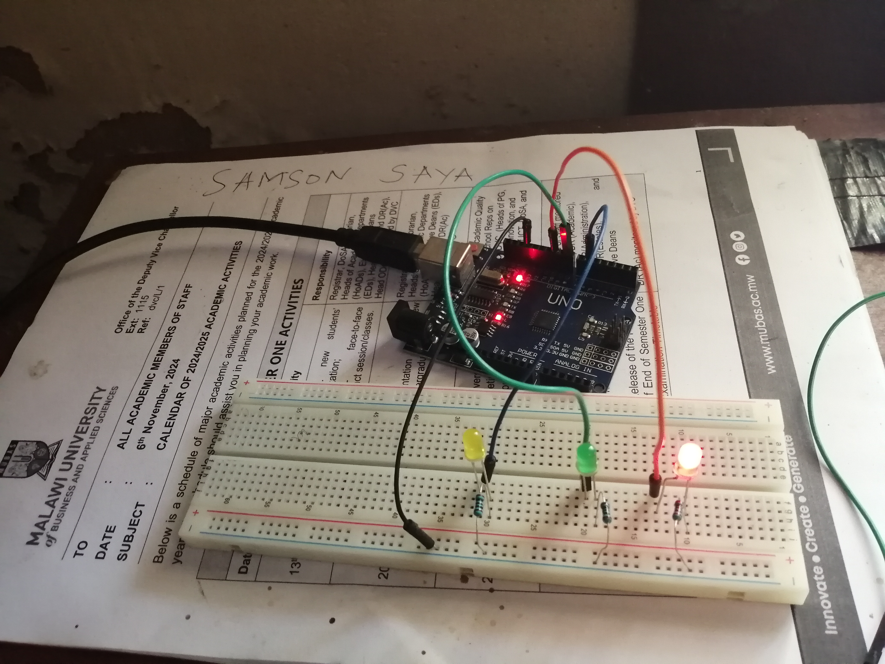
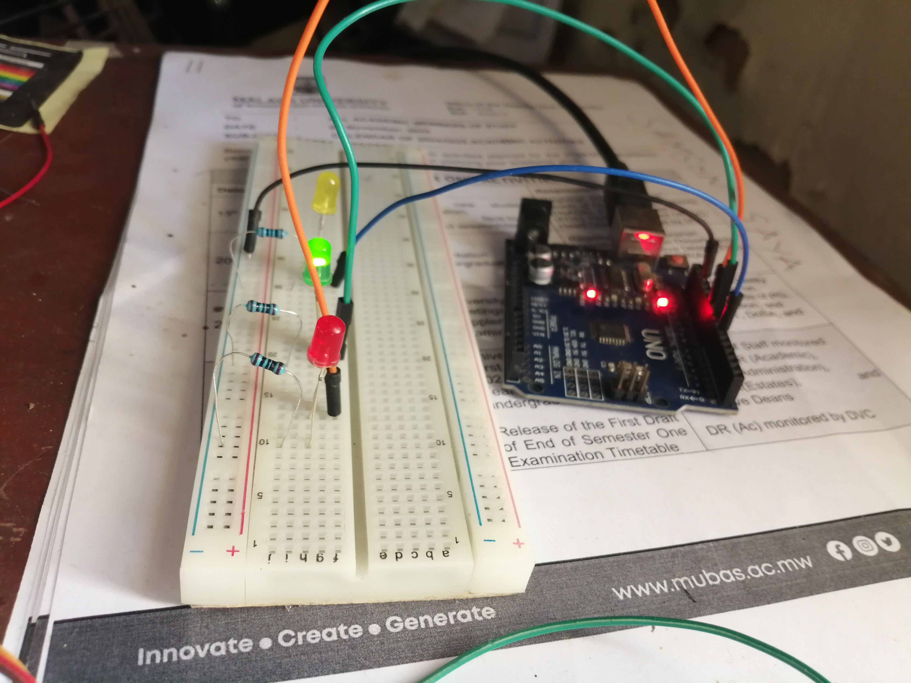
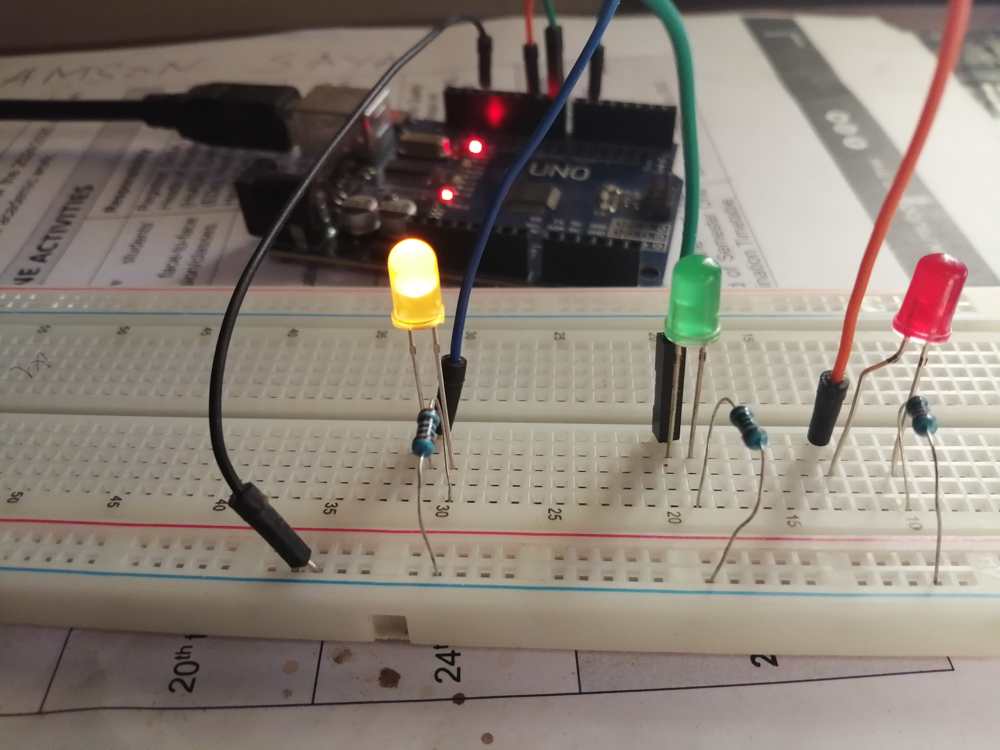
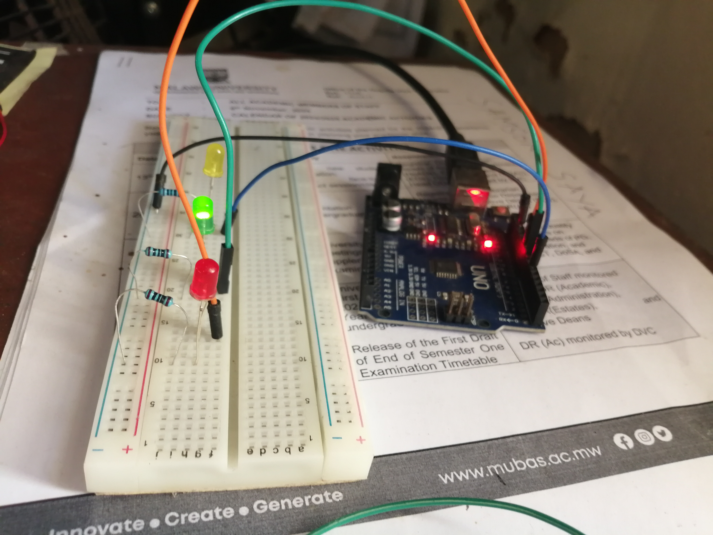
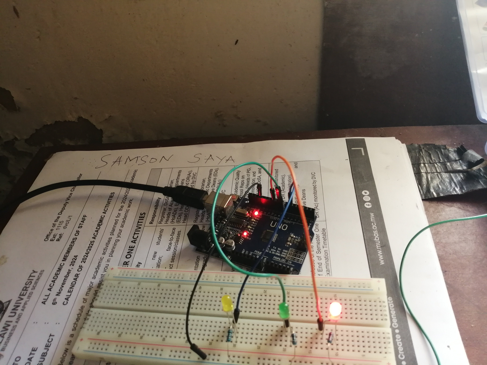
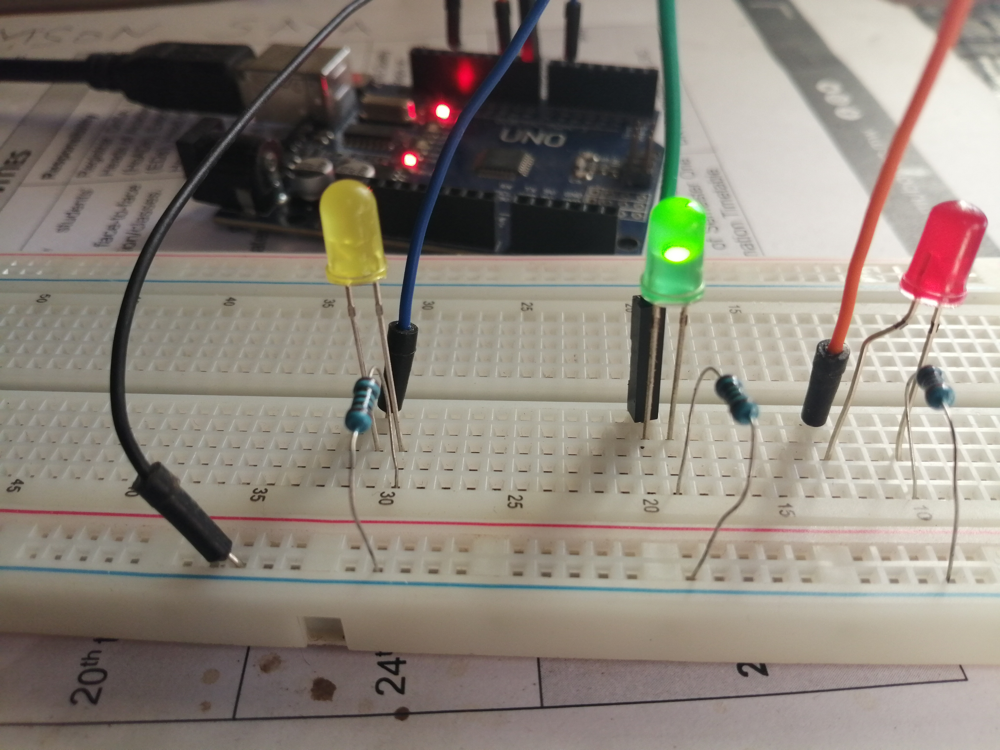

# IOT-Traffic-Light-System
Basic traffic light simulation using Arduino

# Arduino Traffic Light System












A basic traffic light simulation using Arduino Uno. This project demonstrates the fundamental operation of traffic lights with timed transitions between red, orange (amber), and green states.

## Features
- Simulates standard traffic light sequence: Red → Green → Orange → Red
- Configurable timing for each light phase
- Simple circuit using basic components
- Easy to modify and expand

## Components Required
- Arduino Uno board
- 3 LEDs (Red, Green, Orange/Amber)
- 3 x 220Ω resistors
- Breadboard
- Jumper wires

## Circuit Diagram


## Installation & Setup

1. **Hardware Setup:**
   - Connect the LEDs to the Arduino as follows:
     - Red LED: Pin 10 through 220Ω resistor
     - Orange LED: Pin 6 through 220Ω resistor
     - Green LED: Pin 8 through 220Ω resistor
   - Connect all cathode (short leg) sides of LEDs to GND

2. **Software Setup:**
   - Install [Arduino IDE](https://www.arduino.cc/en/software)
   - Clone this repository or download the `TrafficLight.ino` file
   - Open the sketch in Arduino IDE
   - Select the correct board (Arduino Uno) and port
   - Upload the sketch to your Arduino

## Customization
You can easily modify the timing by changing these constants in the code:
```arduino
const unsigned long ORANGE_TIME = 30000;    // 30 seconds
const unsigned long GREEN_TIME = 60000;     // 1 minute
const unsigned long RED_TIME = 90000;       // 1.5 minutes
